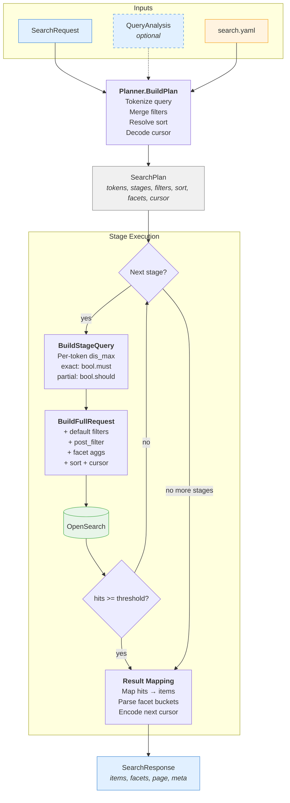
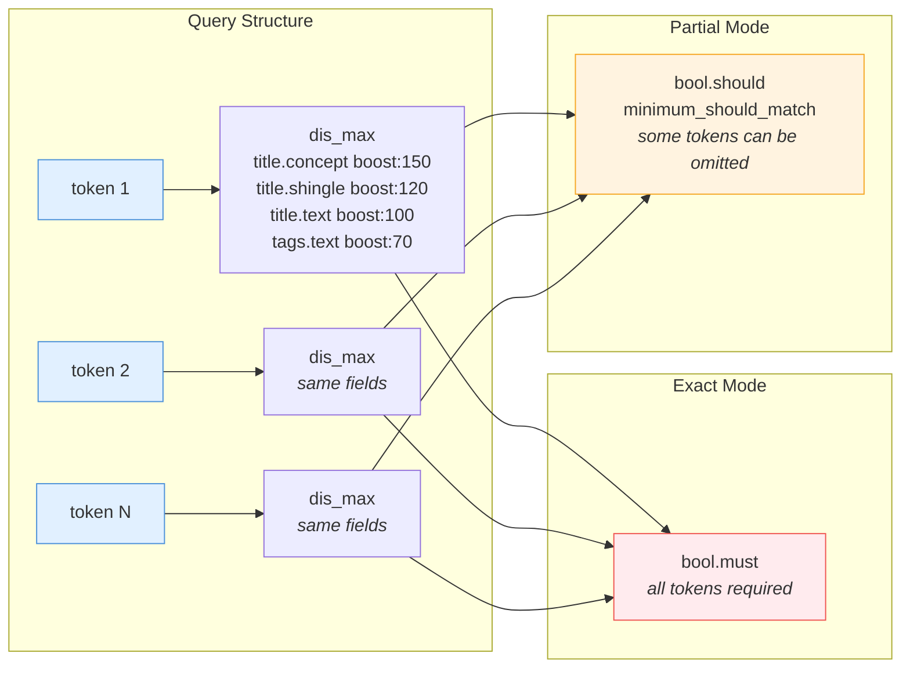
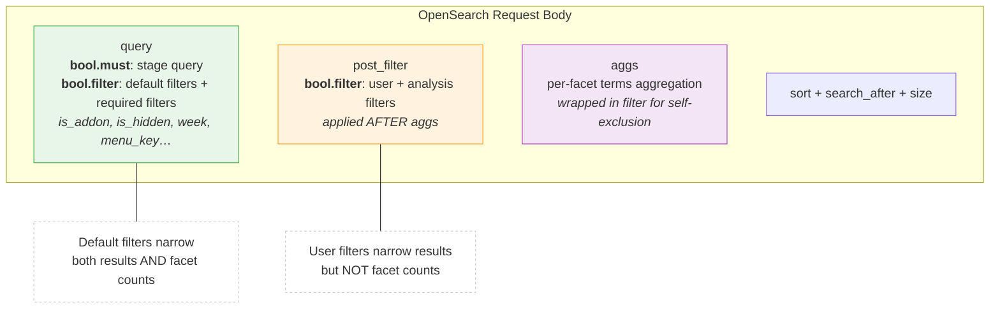
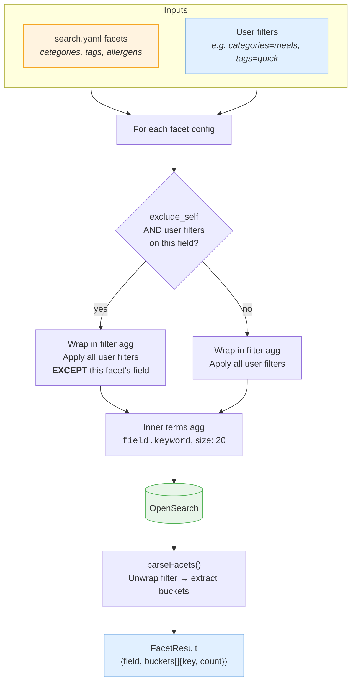

# Orchestration Process

How a search request flows through the orchestrator, from input to OpenSearch response.

---

## Overview







---

## Step 1: Planning

**Entry point:** `Planner.BuildPlan(req, analysis) → SearchPlan`

The planner converts a raw search request into a fully resolved execution plan. Every decision the orchestrator needs is captured in the `SearchPlan` struct — no config lookups happen during execution.

### Tokenization

Two paths:

| Analysis provided | Analysis nil |
|---|---|
| Uses `analysis.Tokens` (already `[]string`) | Splits `req.Query` by whitespace |
| Normalized query from analysis | Raw query string |

### Filter merging

Four filter layers, applied in order of priority:

1. **Default filters** — from `search.yaml` `default_filters`. Applied as `bool.filter` (hard requirements, no scoring). Always present.
   ```
   is_addon=false, is_hidden=false, hide_on_sold_out=false
   ```

2. **Required filters** — from `req.RequiredFilters[]`. Also merged into `bool.filter` alongside defaults. Use for structural filters like `week` or `menu_key` that must restrict hit counts and stage fallback decisions.

3. **User request filters** — from `req.Filters[]`. Applied as `post_filter` (so they don't affect facet counts). Highest priority among user-level filters.

4. **Analysis-inferred filters** — from `analysis.Filters[]`. Also applied as `post_filter`. Skipped if a request filter already exists for the same field (request wins).

### Sort resolution

Priority order:
1. Analysis sort override (`analysis.Sort`) — a sort key name matching `search.yaml` sorts (e.g. `"newest"`)
2. Request sort (`req.Sort`) — must match a key in `search.yaml` `sorts`
3. Default — `relevance` (score desc, id asc)

Every sort includes a tiebreaker field (`id asc`) for deterministic cursor pagination.

### Cursor decoding

If `req.Page.Cursor` is present, it's a base64-encoded JSON array of the last document's sort values. Decoded into `plan.SearchAfter` for OpenSearch's `search_after` pagination.

### Stage preparation

Each stage from `search.yaml` is copied into the plan with its:
- `QueryMode` — `exact` or `partial`
- `MinimumHits` — threshold to accept this stage
- `OmitPercentage` — how many tokens can be omitted (partial only)
- `MaxTermCount` — truncate tokens beyond this count
- `Fields` — which fields to search, each with a boost value

---

## Step 2: Stage Execution

**Entry point:** `Orchestrator.executeStages(ctx, plan) → (osResp, stageName, err)`

Stages run sequentially. The first stage that returns `>= MinimumHits` results wins. If no stage meets its threshold, the last stage's results are returned anyway (best effort).

```
Stage "exact" → 3 hits (need 24) → below threshold, try next
Stage "fallback_partial" → 47 hits (need 1) → threshold met, return
```

### Per-stage query building

Each stage goes through two steps:

#### a) Build the text query — `BuildStageQuery(tokens, stage)`

Tokens are truncated to `MaxTermCount` if needed.

**Per token:** a `dis_max` query across all configured fields. Each field gets its own `match` clause with its boost:

```json
{
  "dis_max": {
    "queries": [
      { "match": { "title.concept": { "query": "chicken", "boost": 150 } } },
      { "match": { "title.shingle": { "query": "chicken", "boost": 120 } } },
      { "match": { "title.text": { "query": "chicken", "boost": 100 } } }
    ]
  }
}
```

`dis_max` picks the single best-matching field per token — no double-counting.

**Combining tokens depends on query mode:**

| Mode | Structure | Behavior |
|---|---|---|
| `exact` | `bool.must` with one `dis_max` per token | Every token must match at least one field |
| `partial` | `bool.should` with `minimum_should_match` | Allows `omit_percentage`% of tokens to not match |

For partial mode, `minimum_should_match` is calculated as:
```
max_omit = floor(token_count × omit_percentage / 100)
min_match = token_count - max_omit
```
Example: 5 tokens, 34% omit → floor(1.7) = 1 omittable → at least 4 must match.

If the math results in all tokens being required, it falls back to `must` (exact) mode.

#### b) Assemble the full request — `BuildFullRequest(stageQuery, plan)`

Wraps the text query with all supporting clauses:

```json
{
  "query": {
    "bool": {
      "must": { ... stage query ... },
      "filter": [ ... default filters ... ]
    }
  },
  "post_filter": {
    "bool": {
      "filter": [ ... user + analysis filters ... ]
    }
  },
  "aggs": { ... facet aggregations ... },
  "sort": [ ... sort specs ... ],
  "search_after": [ ... cursor values ... ],
  "size": 24
}
```

**Why two filter locations?**
- `bool.filter` (default filters): applied before aggregations — facet counts reflect these constraints
- `post_filter` (user filters): applied after aggregations — facet counts are NOT narrowed by the user's own facet selections

### Facet aggregations

```mermaid
flowchart LR
    subgraph "Example: user selects categories=meals"
        direction TB

        subgraph "categories agg (exclude_self)"
            CF1["filter: tags=quick only<br/><i>categories filter excluded</i>"]
            CF1 --> CA["terms: categories.keyword"]
            CA --> CR["meals: 47<br/>desserts: 23<br/>sides: 15<br/><i>all values visible</i>"]
        end

        subgraph "tags agg (exclude_self)"
            TF1["filter: categories=meals only<br/><i>tags filter excluded</i>"]
            TF1 --> TA["terms: tags.keyword"]
            TA --> TR["quick: 31<br/>healthy: 18<br/>premium: 12<br/><i>all values visible</i>"]
        end

        subgraph "allergens agg (exclude_self)"
            AF1["filter: categories=meals + tags=quick"]
            AF1 --> AA["terms: allergens.keyword"]
            AA --> AR["gluten: 22<br/>dairy: 19<br/>nuts: 8"]
        end
    end

    style CR fill:#e8f5e9,stroke:#4caf50
    style TR fill:#e8f5e9,stroke:#4caf50
    style AR fill:#e8f5e9,stroke:#4caf50
```





Each configured facet becomes a `terms` aggregation on `{field}.keyword`.

When `exclude_self: true`, the aggregation is wrapped in a `filter` aggregation that applies all user filters *except* the one for its own field. This means selecting "meals" in the category facet still shows all other category values with their full counts.

```json
{
  "agg_categories": {
    "filter": {
      "bool": { "filter": [ ... all user filters except categories ... ] }
    },
    "aggs": {
      "categories": { "terms": { "field": "categories.keyword", "size": 20 } }
    }
  }
}
```

### Index resolution

The index pattern from config (e.g. `hellofresh_{market}_productsonline`) has `{market}` replaced with the lowercased market from the request.

---

## Step 3: Result Mapping

After a stage wins (or the last stage is used as fallback), the OpenSearch response is mapped to a `SearchResponse`:

### Items

Each hit's `_source` is unmarshalled and mapped to a `SearchItem`:
- `id` — from source `id` field, falls back to OpenSearch `_id`
- `title`, `description`, `headline`, `slug`, `imageUrl`
- `categories`, `tags`, `allergens`, `ingredients`
- `score` — the relevance score from OpenSearch

### Facets

Each configured facet is extracted from the aggregation response:
- Unwraps the outer filter aggregation wrapper
- Reads the inner `terms` aggregation buckets
- Maps to `FacetResult{Field, Buckets[]{Key, Count}}`

### Pagination

- `hasNextPage` — true if the number of hits equals `PageSize` (there may be more)
- `cursor` — base64-encoded JSON of the last hit's sort values, used as `search_after` in the next request

### Metadata

- `totalHits` — from OpenSearch `hits.total.value`
- `stage` — name of the winning stage (useful for debugging/monitoring)
- `warnings` — forwarded from query analysis (e.g. upstream degradation warnings)

---

## Filter Operators

| Operator | OpenSearch Query | Notes |
|---|---|---|
| `eq` | `term` | Exact match on keyword field |
| `in` | `terms` | Match any of the provided values |
| `gt`, `gte`, `lt`, `lte` | `script` (painless) | Parses keyword values as doubles for correct numeric comparison |

Range filters use painless scripts because index fields may be stored as keywords. See [problems-and-solutions.md](problems-and-solutions.md#3-range-filters-broke-on-keyword-fields-lexicographic-vs-numeric-comparison) for why.

---

## Data Flow Summary

```
SearchRequest
  .Query           → Planner tokenizes (or uses analysis tokens)
  .Locale          → passed through (not used by orchestrator directly)
  .Market          → resolves index name
  .Sort            → resolves sort spec from config
  .Page.Size       → OpenSearch "size"
  .Page.Cursor     → decoded to "search_after"
  .Filters         → post_filter (user filters)
  .RequiredFilters → bool.filter (merged with defaults, restricts hit counts)

search.yaml
  .stages       → sequential execution with threshold fallback
  .fields       → per-token dis_max queries with boost
  .default_filters → bool.filter (always applied)
  .sorts        → named sort definitions
  .facets       → terms aggregations with self-exclusion

QueryAnalysis (optional)
  .NormalizedQuery → override raw query
  .Tokens          → override tokenization ([]string)
  .Filters         → merged into post_filter (lower priority than request filters)
  .Sort            → override sort selection (sort key name)
  .Warnings        → forwarded to response metadata
```
